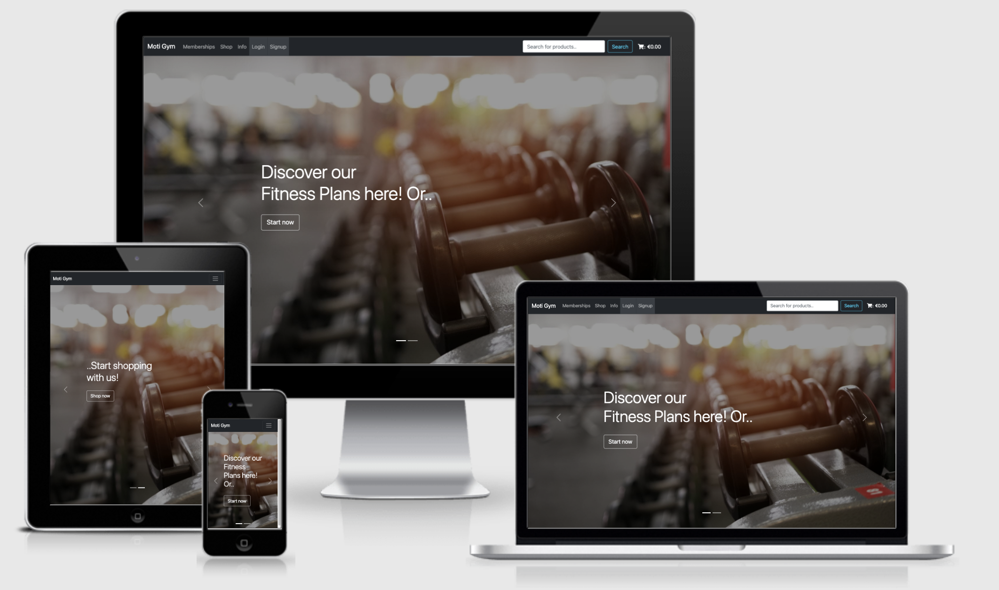

# MOTIGYM
## A Milestone 4 Project by Simone Casoni

[View the live project](https://motigym.herokuapp.com/info/)

This website was designed to be a e-commerce/info site for a group of local gyms in Dublin (Motigym). Please, consider this website for educational purposes only.

---

## User Experience (UX)

* **User Stories** 
    * **As a customer**
        1. I want to be able to look what kind of memberships the gym offers
        2. I want to be able to contact the gym in case I decide to join
        3. I want to be able to buy products from their stores 
        4. I want to be able to see my previous purchases
        5. I want to be able to register an account so that my default information can be saved for future purchased
        6. I want to be able to retrieve my password in case I forget it

    * **As the owner of the store**
        1. I want to be able to sell gym equipment/products through the site
        2. I want to be able to upload possible new equipment/products to the site, edit the existing ones, and delete any that are no longer available
        3. I want to be able to show the different types of Memberships
        4. I want people to be able to contact me for more information
        5. I want to be able to check all the messages from the customers
        
---

## Testing

[View the full TESTING.md documentation](https://github.com/Simocaso/MS4_Casoni/blob/master/TESTING.md)

---

## Design

### Colour Scheme  
Through all site, I decided to keep a dark grey team so that the users could already experience a GYM environment, reconnecting the website to the colour of iron. In contrast, you will also see a nice bootstrap info color (#0dcaf0) to find what to do next in your current page quickly!

### Typography

Biotif, combined with the classic bootstrap font, was used throughout the project to help the overall design looking user-friendly.

### Imagery

The images used throughout the site were taken from https://unsplash.com/

---
### Wireframes

The wireframes for the site were created in balsamiq and uploaded as a pdf. They can be found as a pdf file [here.](https://github.com/Simocaso/MS4_Casoni/blob/master/wireframes)
